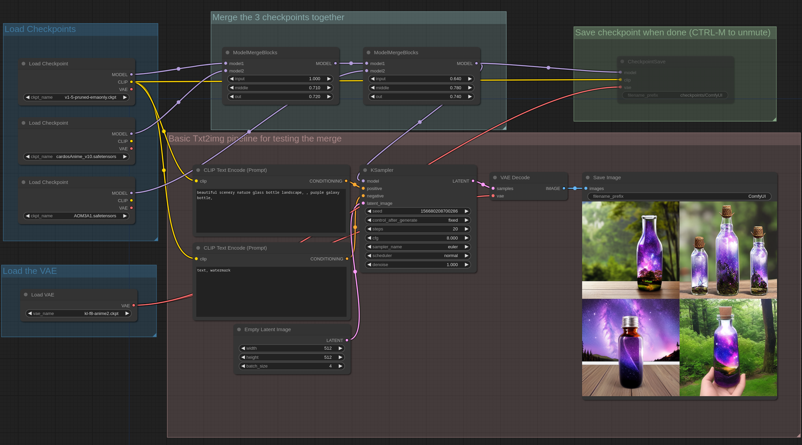
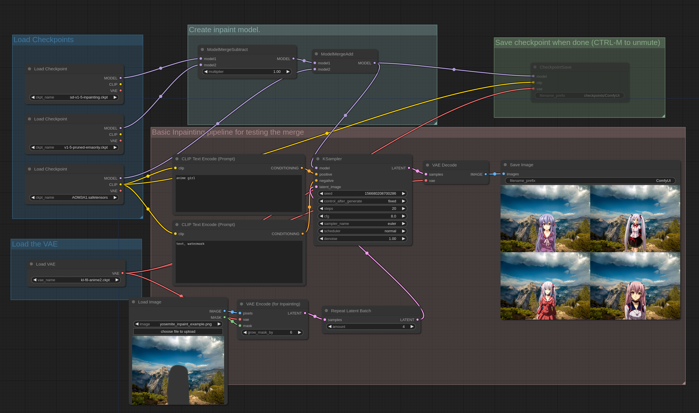
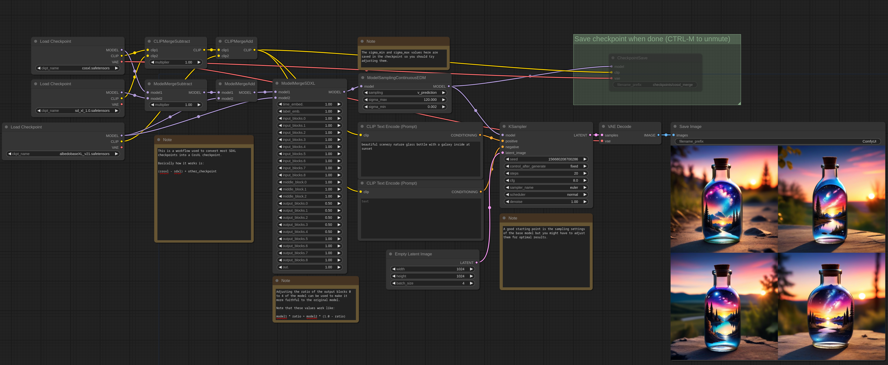

# Model Merging Examples

The idea behind these workflows is that you can do complex workflows with multiple model merges, test them and then save the checkpoint by unmuting the CheckpointSave node once you are happy with the results. By default the CheckpointSave node saves checkpoints to the output/checkpoints/ folder.

You can find these nodes in: advanced->model_merging

This first example is a basic example of a simple merge between two different checkpoints.

You can Load these images in [ComfyUI](https://github.com/comfyanonymous/ComfyUI) to get the full workflow.

In ComfyUI the saved checkpoints contain the full workflow used to generate them so they can be loaded in the UI just like images to get the full workflow that was used to create them.

This example is an example of merging 3 different checkpoints using simple block merging where the input, middle and output blocks of the unet can have a different ratio:

Since Loras are a patch on the model weights they can also be merged into the model:

You can also subtract models weights and add them like in this example used to create an inpaint model from a non inpaint model with the formula: `(inpaint_model - base_model) * 1.0 + other_model`
If you are familiar with the "Add Difference" option in other UIs this is how to do it in ComfyUI.

One important thing you should note is that models are merged and saved in the precision that is used for inference on your hardware so usually it will be 16 bit float. If you want do do merges in 32 bit float launch ComfyUI with: --force-fp32

### Advanced Merging

#### CosXL

Here is an example of how to create a CosXL model from a regular SDXL model with merging. The requirements are the [CosXL base model](https://huggingface.co/stabilityai/cosxl), the [SDXL base model](https://huggingface.co/stabilityai/stable-diffusion-xl-base-1.0/blob/main/sd_xl_base_1.0_0.9vae.safetensors) and the SDXL model you want to convert. In this example I used [albedobase-xl](https://civitai.com/models/140737/albedobase-xl).

